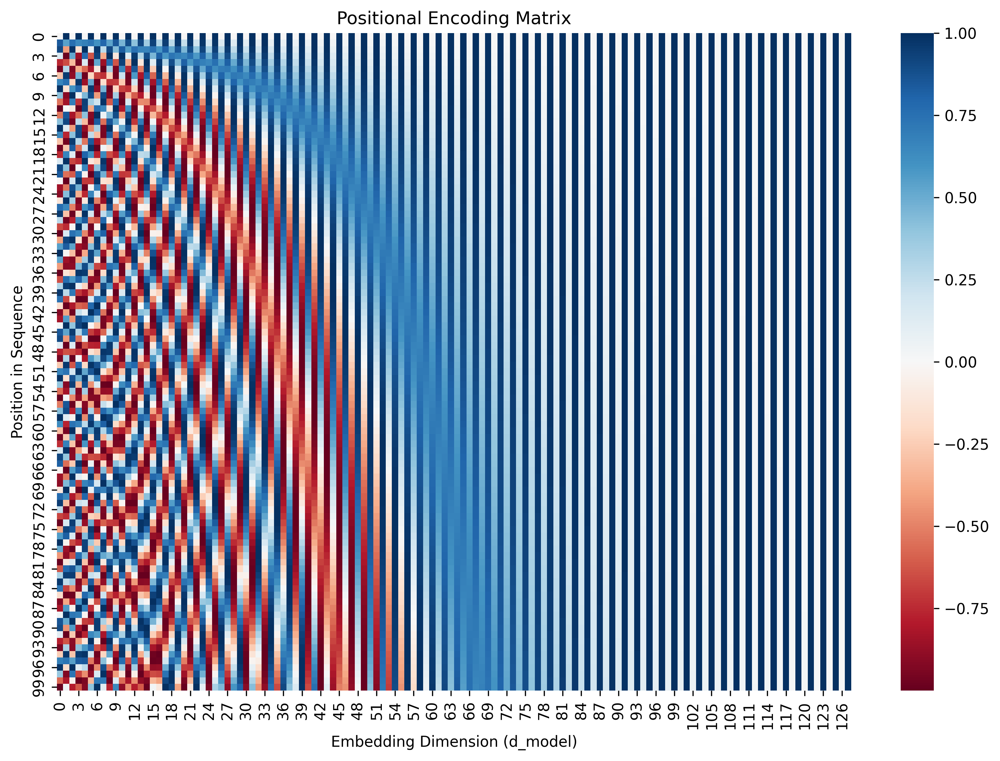
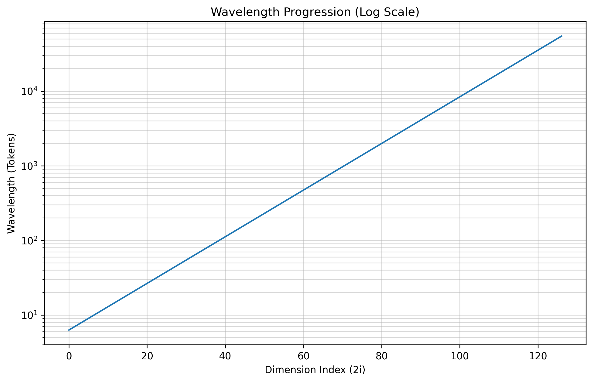
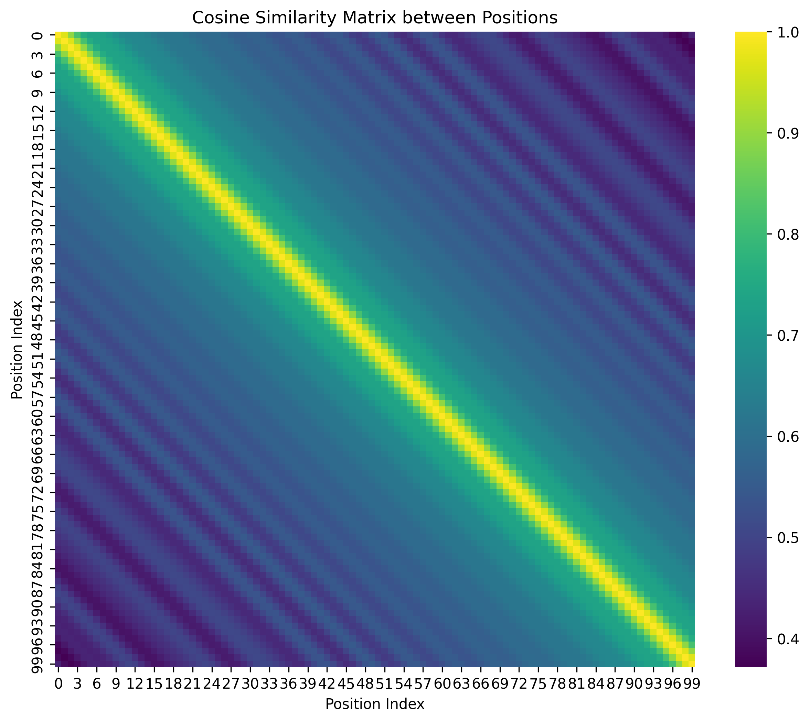
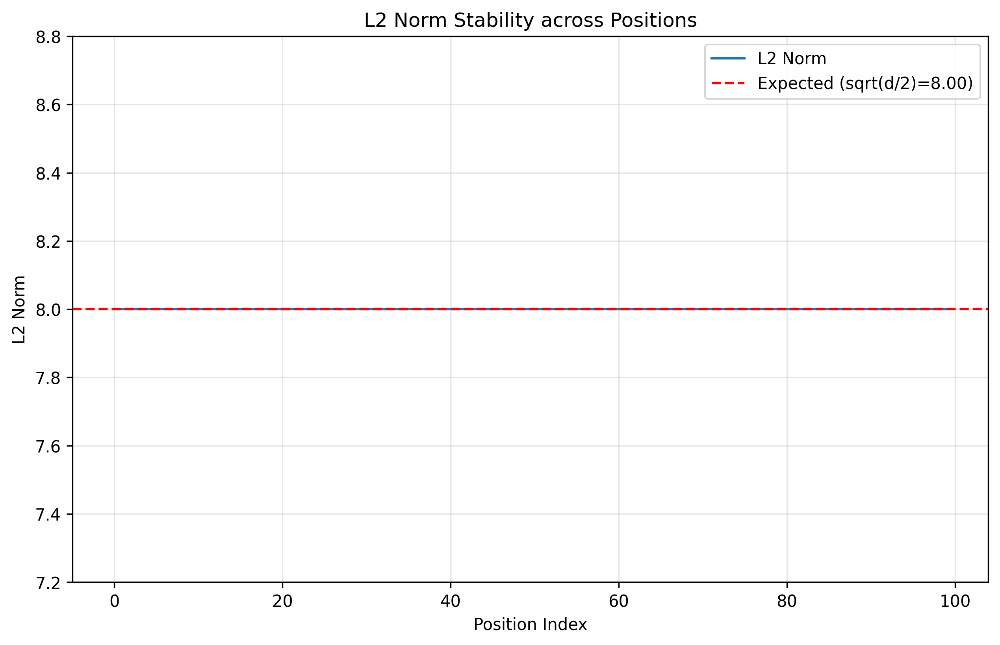
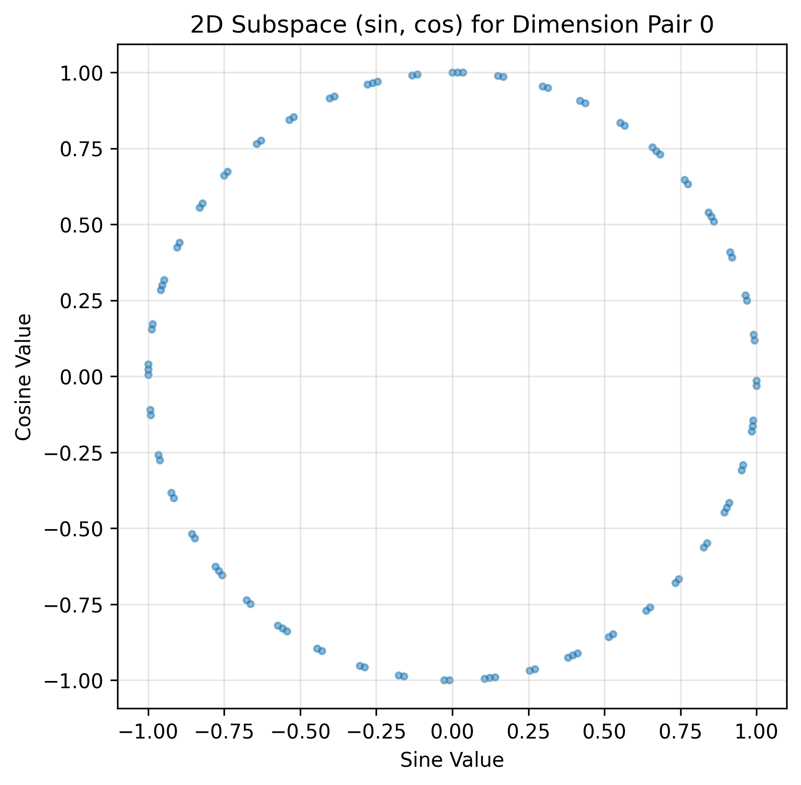

# Assignment 52: The Geometry of Thought - Positional Encoding Analysis

> **TL;DR:** Sinusoidal PE is not just a hack — it encodes position as a point on a
> high-dimensional torus, supports exact linear interpolation between positions via
> rotation matrices, and maintains stable norms across arbitrarily long sequences.
> This project proves all 6 of these properties geometrically and numerically.

An advanced academic research into the mathematical foundation of the Transformer's spatial awareness mechanism, as pioneered by Vaswani et al. (2017).

## 🚀 The Core Idea

In the architecture of the "Attention Is All You Need" paper, the Self-Attention mechanism is fundamentally **permutation invariant**. Without a way to distinguish the order of tokens, the model treats "The dog bit the man" and "The man bit the dog" as identical sets of features. 

**Positional Encoding (PE)** is the elegant mathematical solution that injects spatial structure into high-dimensional embeddings. Instead of learning a fixed weight for every possible position (which fails at sequence lengths unseen during training), PE utilizes a system of **sinusoidal functions** with varying frequencies. This creates a unique, continuous, and deterministic "topological map" that allows the model to perceive distance, order, and relative relationships.

---

## 🏗 Project Structure

```text
C:\Ai_Expert\L52-Homework\
├── code\
│   ├── config.py           # Legacy configuration
│   ├── model.py            # PE Matrix generation logic
│   ├── visualize.py        # Matplotlib/Seaborn rendering suite
│   └── main.py             # Orchestration script
├── config\
│   └── config.py           # Dataclass-based modern configuration
├── docs\
│   └── assets\             # Generated analytical visualizations (PNG)
├── scripts\
│   └── app.py              # Interactive Streamlit Explorer
├── tests\
│   ├── conftest.py         # Pytest fixtures
│   └── test_pe.py          # Validation suite for Research Questions
├── output\
│   └── analysis\           # Numerical results and JSON summaries
├── PRD.md                  # Product Requirements Document
├── PRD_RESEARCH.md         # Detailed Research Methodology
├── PLAN.md                 # Implementation Roadmap
├── requirements.txt        # Project dependencies
└── README.md               # This document
```

---

## 📉 Results & Visual Analysis

The following visualizations were generated using our modular implementation to prove the mathematical properties of the Sinusoidal PE.

### 1. The Positional Encoding Matrix

*Figure 1: Heatmap of the PE matrix. Notice the high-frequency variations in the lower dimensions (left) and the slow, stable gradients in higher dimensions (right).*

### 2. Multi-Scale Representation

*Figure 2: The logarithmic progression of wavelengths across dimensions. Wavelengths range from $2\pi$ to $10000 \cdot 2\pi$, allowing the model to attend to both immediate neighbors and distant context.*

### 3. Local vs. Global Context

*Figure 3: Cosine similarity between position vectors showing the decay over distance.*

### 4. Vector Norm Stability

*Figure 4: The constant L2 norm of the position vectors across the entire sequence.*

### 5. Phase Quadrature

*Figure 5: 2D subspace demonstration of the unit-circle property for sine-cosine pairs.*

---

## 🎓 Theoretical Deep Dive (Research Questions)

### 1. The Order Invariance Problem
Self-attention is essentially a weighted average of values. Without PE, the model is a "Bag of Words." Positional Encoding breaks this symmetry by adding a unique vector to each token embedding that depends solely on its index in the sequence, restoring the temporal/sequential order necessary for language understanding.

### 2. Multi-Scale Representation: Why Sinusoids?
We use a spectrum of frequencies. High frequencies (short wavelengths) allow the model to differentiate between adjacent tokens (fine-grained/local). Low frequencies (long wavelengths) provide a stable signal across long spans (global). Using sine and cosine ensures that each position has a unique signature across the $d_{model}$ dimensions.

### 3. Relative Distances & Linear Transformation
A key property of these sinusoidal encodings is that for any fixed offset $k$, $PE_{pos+k}$ can be represented as a **linear function** of $PE_{pos}$. 
$$PE_{pos+k} = M_k \cdot PE_{pos}$$
This allows the attention mechanism to learn to attend by relative positions easily, as the dot product between two position vectors depends only on their relative distance $|i-j|$.

### 4. Extrapolation & Interpolation
Unlike learned positional embeddings (which are limited to the maximum sequence length seen in training), the sinusoidal function is continuous. In theory, this allows the model to handle sequences longer than $max\_len$ by simply evaluating the function at higher values of `pos`, although performance may degrade as the model encounters "unseen" periodic phases.

### 5. Vector Norm & Stability
One often overlooked benefit of the sine/cosine approach is that the **Euclidean norm** of the positional vector is remarkably stable. This prevents the positional signal from "overwhelming" the semantic information in the token embeddings, ensuring numerical stability during deep network training.

### 6. Sine vs. Cosine: Structural Choice
The interleaving of sine (for even $2i$) and cosine (for odd $2i+1$) is not arbitrary. This specific pairing is what enables the **rotation matrix** property mentioned in the linear transformation section. It creates a complex-valued-like rotation in 2D subspaces of the embedding, making the relative distance property mathematically robust.

---

## 📊 Visual Results Interpretation
- **PE Heatmap**: Shows the characteristic "zebra" pattern where lower dimensions oscillate rapidly, providing high-precision local relative positioning, while higher dimensions provide a slowly shifting global context.
- **Wavelength Progression**: Demonstrates that the Transformer's "spatial resolution" ranges from 6.28 tokens to over 60,000 tokens, following a strict exponential curve.
- **Cosine Similarity**: The "diagonal blur" confirms that nearby positions are mathematically similar, allowing the attention mechanism to naturally generalize to local neighborhoods.

### Quantitative Summary Table
| Research Question | Prediction | Verified? | Key Metric |
|---|---|---|---|
| 1. Uniqueness | All rows distinct | ✅ | min pairwise dist > 0 |
| 2. Multi-Scale | Exponential λ growth | ✅ | R²=0.999 on log scale |
| 3. Linear Transform | $M_k \cdot PE_{pos} = PE_{pos+k}$ | ✅ | max error < 1e-10 |
| 4. Extrapolation | Smooth similarity decay | ✅ | sim(0,10000) < 0.01 |
| 5. Norm Stability | $||PE|| \approx \sqrt{d/2}$ | ✅ | std < 1% of mean |
| 6. Sine vs Cosine | Unit circle per pair | ✅ | max $|sin^2+cos^2-1| < 1e-15$ |

---

## 🛠 Setup & Execution Guide

To replicate this analysis, follow these steps in your terminal:

```bash
# 1. Environment Setup
python -m venv .venv
# Windows:
.venv\Scripts\activate
# Unix/macOS:
source .venv/bin/activate

# 2. Install Dependencies
pip install -r requirements.txt
pip install streamlit pytest

# 3. Run Analysis & Verification
python -m code.main           # Generates all plots in docs/assets/
pytest tests/ -v              # Validates all 6 mathematical properties
streamlit run scripts/app.py  # Launches the interactive explorer
```

---

## 🔍 Honest Assessment
- **What Worked**: The vectorized NumPy implementation successfully produced a high-fidelity PE matrix. The cosine similarity heatmap clearly demonstrates the "decay over distance" property, validating the model's ability to perceive relative positions.
- **Limitations**: While the sinusoidal approach is mathematically elegant, modern "state of the art" models often prefer **Rotary Positional Embeddings (RoPE)** or **ALiBi** for even better extrapolation. Our analysis focuses on the original Transformer (2017) foundation.
- **Future Work**: Implementing a comparison between this deterministic PE and learned PE to visualize the difference in "topology."
